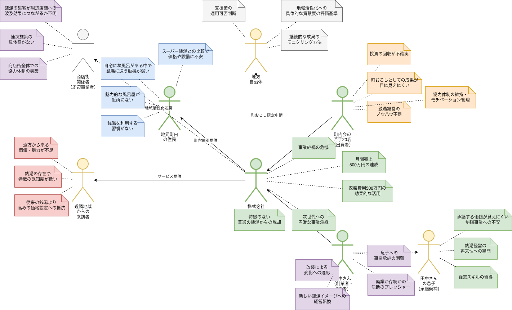
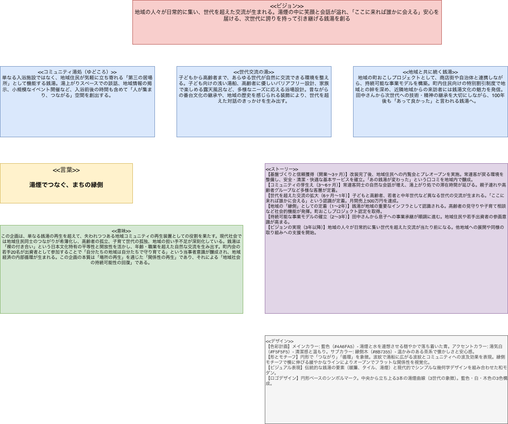
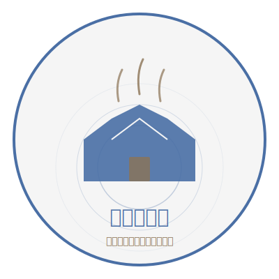
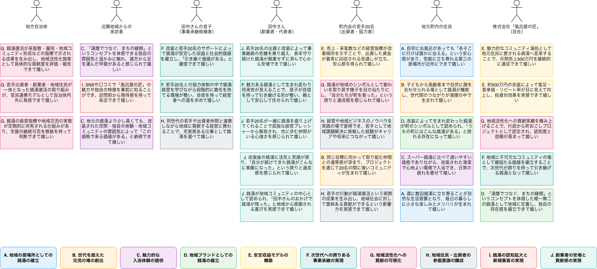
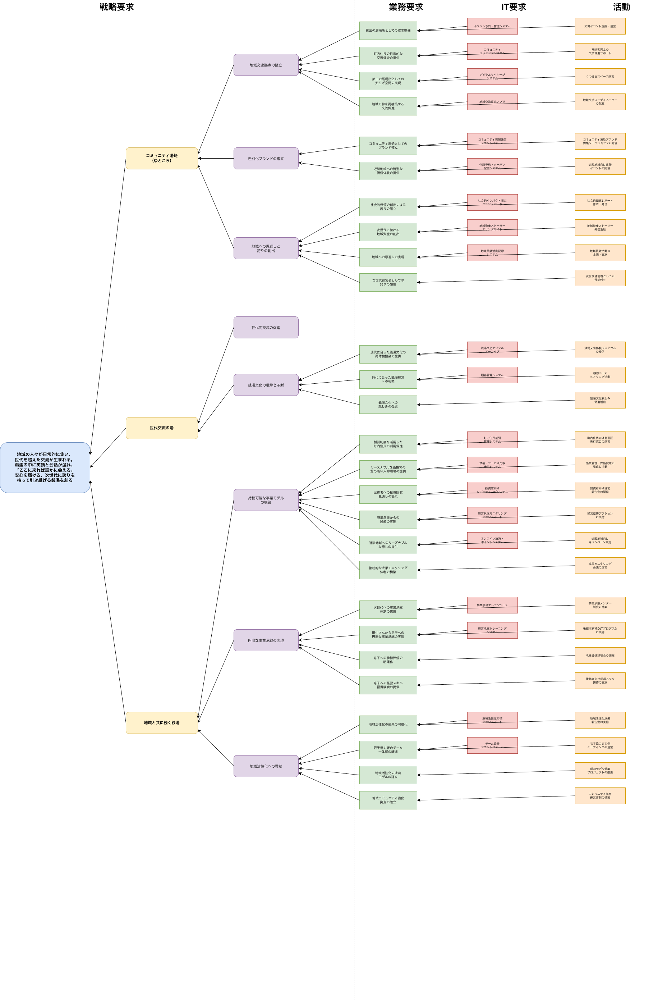
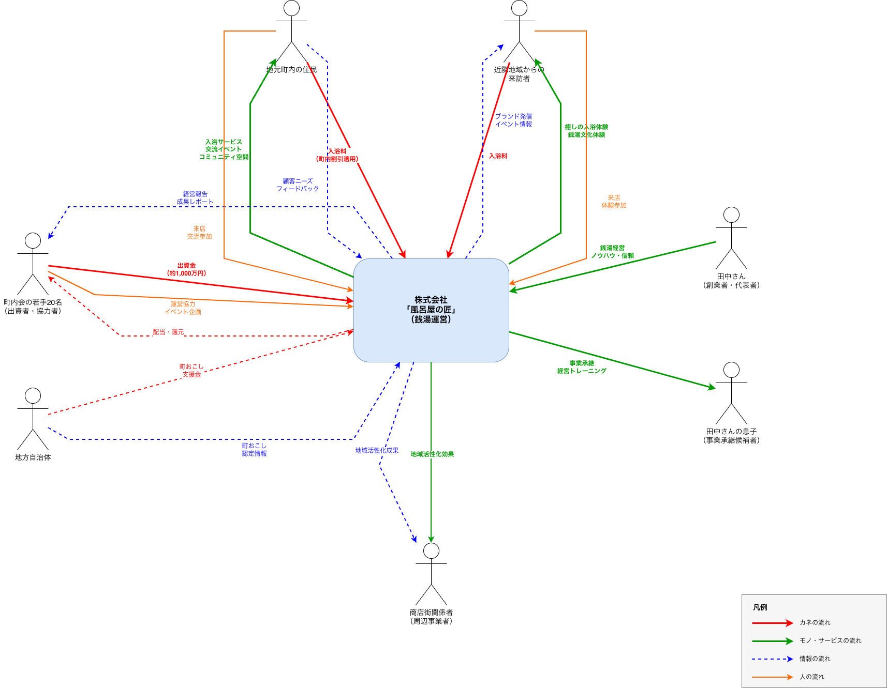

# 匠Method Agent

## 匠Method Agentとは
ビジネスデザインのための体系的メソッド「匠Method」のプロセスを支援するAI Agentツールです。

企画案をもとに、ステークホルダーモデル、価値デザインモデル、価値分析モデル、要求分析ツリーなどの各種モデルを生成できます。

さらに、これらの匠Methodのモデルを基盤としてプロジェクト計画を策定し、提案書まで一貫して作成します。

## 匠Method Agentの機能

### 企画案の作成
* ユーザーが質問に回答することで企画案を作成します。
* 既存の製品・サービス情報をWebからリサーチし、企画案を生成します。

### モデルの生成
* 匠Methodのコアモデル4つ（ステークホルダーモデル、価値デザインモデル、価値分析モデル、要求分析ツリー）をDrawIO形式で生成します。
* ビジネスコンテキストフロー（DrawIO形式）を生成します。
* ゴール記述モデル（TSV形式）を生成します。

### 評価
* Value Metricsを実施します（価値概念の作成とスコア付け、IT要求／活動のスコア付け、価値概念とIT要求／活動のスコア比較・評価）。

### 評価・計画・企画書
* Value Metricsとシステム思考の因果ループにおけるレバレッジポイントをもとに、プロジェクトの実行計画を作成します。
* 匠Methodのモデルや計画をもとに、提案書スライドを作成します。

### 検証・説明
* モデルの説明（例：価値分析モデルとはどのようなモデルか）をAIが行います。
* モデルの検証、洗練をAIが行います。

### 実行方式
* バッチによる一括作成（アイデア→提案書作成）と、ステップバイステップでのモデル作成の両方をサポートします。

- [匠Method Agentのプロセスフロー](docs/process-flow.drawio.png)

## 出力サンプル

テーマ：風呂屋の匠

書籍、『[匠Method: 〜新たな価値観でプロジェクトをデザインするために〜](https://amzn.asia/d/0diH5tAt) 』の第7章 匠Methodで商店街の風呂屋を復活させる、より抜粋。

```
長年、銭湯を経営している田中さんは最近、事業継続が不可能になるのではと悩んでいます。
このままでは息子にバトンを渡すのが難しい。
商店街ではそれなりにお客さんは入っていますが、何の特徴もないお風呂屋さんです。
廃業か存続か、悩む日々。

そんな悩みを町内会の皆さんに相談しました。
すると「なんとか存続させたい」と、町内会の若手20名が一大決心して、
田中さんを代表とする株式会社「風呂屋の匠」を設立しようという話になりました。
```

### 企画ファイル

[企画の元となるファイル：samples/furoya-takumi/input/idea.md](samples/furoya-takumi/input/idea.md)

### 匠Method Agentで自動生成された成果物

#### ステークホルダーモデル


#### 価値デザインモデル


##### デザインロゴ


#### 価値分析モデル


#### 要求分析ツリー


#### ビジネスコンテキストフロー


#### ゴール記述モデル
[samples/furoya-takumi/output/goal-description-model.tsv](samples/furoya-takumi/output/goal-description-model.tsv)

#### 匠Method Value Metrics

[価値概念とIT要求/活動のスコア比較：samples/furoya-takumi/output/vm-compare-score.md](samples/furoya-takumi/output/vm-compare-score.md)

#### MSP(Minimum Sellable Product)の計画
[samples/furoya-takumi/output/msp-plan.md](samples/furoya-takumi/output/msp-plan.md)

#### 企画提案書（企画の最終成果物）
[samples/furoya-takumi/output/proposal-format1.md](samples/furoya-takumi/output/proposal-format1.md)

#### その他の成果物
[samples/furoya-takumi/output配下](samples/furoya-takumi/output/)

## 対応OS

Skillファイル内のファイル操作はClaude Codeの組み込みツール（Glob、Read、Write等）を使用しており、OS非依存で動作します。

- 推奨環境：macOS、Linux
- 動作未検証：Windows

## 使用ツール

### 必須
- **Claude Code** - Anthropic公式のCLIツール（https://docs.anthropic.com/en/docs/claude-code）

**他のAIツールへの展開について**

現バージョンでは Claude Code での使用を想定しています（他のAIツールでの動作は未検証）。ただし、本プロジェクトのSkillファイル（`.claude/skills/`）は、AnthropicがオープンAI標準（[Agent Skills open standard](https://docs.anthropic.com/en/docs/claude-code/skills)）として設計した形式に基づいており、特定のツールに依存しない構造を採用しています。そのため、同標準に対応するAIツールであれば、Skillファイルをそのまま活用できる可能性があります。

### 任意
- [Visual Studio Code](https://code.visualstudio.com/)
  - 匠Method Agentは、ターミナルなどのCLI環境があれば動作しますが、役立つプラグインが豊富な点から、Visual Studio Codeの利用を推奨します。
- **DrawIO** - 生成された `.drawio` ファイルの閲覧・編集用（ネイティブアプリ）

#### Visual Studio Codeのプラグイン（参考）
- TSV Tweaker
- DrawIO Integration
  - DrawIO形式ファイルの編集および参照が可能です（ただし、操作性の観点からはDrawIO公式のネイティブアプリの利用を推奨します）
- JSON Crack
  - JSONのツリー構造をプレビューできます（要求分析のJSONをツリー形式で参照可能です。ただし、ツリーが大きくなると視認性は高くありません）。
- MarkDown Preview Mermaid Support
  - MarkdownおよびMermaid.jsのプレビュー（分析結果の表や因果ループ図の表示）
- Marp for VS Code
  - Marp形式(Markdown Presentation Ecosystem)の提案書をプレビュー

## セットアップ

```bash
# 1. リポジトリを取得（いずれかの方法）
# 方法A: git clone
git clone <repository-url>
cd <展開したルートディレクトリ>

# 方法B: GitHubからZIPをダウンロードして展開
# トップページの「Code」（右上、緑ボタン）→「Download ZIP」からダウンロードし、展開したフォルダに移動
cd <展開したルートディレクトリ>

# 2. Claude Codeにログインした状態で、ルートディレクトリをCLIのターミナルで開く

# 3. Claude Codeを起動
claude

# 4. 企画案を準備（以下のいずれかの方法）
```

### 企画案の準備

モデリングを開始するには、`input/idea.md` に企画案を用意します。3つの方法があります。

**方法1: 対話型で作成**

```
/idea-create
```

質問に答えていくだけで企画案が生成されます。

**方法2: 既存製品・サービスから生成**

```
/idea-create-by-product-research https://example.com/product
```

URLを指定すると、製品・サービスを分析して企画案を自動生成します。複数URLも指定可能です。

**方法3: 手動作成**

`input/idea.md` を以下の形式で直接作成します。

```markdown
# 企画案

## 企画の背景、問題意識、企画者の思い
[解決したい課題や問題意識を記載]

## 企画の背景、問題意識を解決するためのアイデア（概要）
[アイデアの概要を記載]
```

## 使い方

大きく以下の2パターンがあります。

- 全成果物一括実行：まずは一括実行したい場合
- ステップバイステップのコマンド実行：成果物を確認、修正しながら進める場合

全体のプロセスフローは以下のファイルを参照してください。

- [docs/process-flow.drawio](docs/process-flow.drawio) (DrawIO)
- [docs/process-flow.drawio.png](docs/process-flow.drawio.png) (画像)

### クイックスタート

#### 全成果物一括実行

企画案を準備したら、以下のコマンドで全成果物を一括生成できます。

```
# テキストデータ + DrawIOモデルを全て作成
/takumi-method-all

# テキストデータ（TSV）のみ作成
/takumi-method-all-only-text-data
```

上記コマンドの実行後、以下の出力ファイルを確認してください。

- `output/proposal-format1.md`（すべてのモデルをもとに作成した提案書ファイル：Marp形式）
- `output/drawio/` 配下のdrawioファイル（複数）

ファイルが作成されていない場合は、CLIから以下の内容を入力し、Claude Codeに指示してください（原因については、後述の「トラブルシューティング」を参照してください）。

```
output/フォルダ内にファイルが作成されていないようです。出力内容を確認し、再度出力してください。
```

#### ステップバイステップの実行

ステークホルダーモデルの作成から初めます。

```
# hase 1-1（ステークホルダー抽出とTSV生成）を実行
/stakeholder-extractor
```

全体の流れは、[docs/process-flow.drawio.png](docs/process-flow.drawio.png) を参照してください。

### 検証/洗練

- `verify-*` コマンドにより、モデルおよび各要素の内容を検証できます。
- `refine-*` コマンドにより、検証結果に基づいてモデルの各要素を洗練・修正します。対応する `verify-*` コマンドを先に実行しておく必要があります。


#### ステークホルダーモデル

| 要素／モデル名     | 検証コマンド                | 洗練コマンド                |
| ----------- | --------------------- | --------------------- |
| ステークホルダーモデル | `/verify-stakeholder` | `/refine-stakeholder` |

---

#### 価値デザインモデル

| 要素／モデル名 | 検証コマンド               | 洗練コマンド               |
| ------- | -------------------- | -------------------- |
| ビジョン    | `/verify-vision`     | `/refine-vision`     |
| コンセプト   | `/verify-concept`    | `/refine-concept`    |
| キャッチコピー | `/verify-catch-copy` | `/refine-catch-copy` |
| 意味      | `/verify-meaning`    | `/refine-meaning`    |
| ストーリー   | `/verify-story`      | `/refine-story`      |
| デザイン    | `/verify-design`     | `/refine-design`     |

---

#### 価値分析モデル

| 要素／モデル名       | 検証コマンド                                   | 洗練コマンド                                   |
| ------------- | ---------------------------------------- | ---------------------------------------- |
| 価値記述          | `/verify-value-description`              | `/refine-value-description`              |
| 価値記述（売上・利益観点） | `/verify-value-description-sales-profit` | `/refine-value-description-sales-profit` |
| 目的            | `/verify-objective`                      | `/refine-objective`                      |

---

#### 要求分析ツリー

| 要素／モデル名 | 検証コマンド                         | 洗練コマンド                         |
| ------- | ------------------------------ | ------------------------------ |
| 業務要求    | `/verify-business-requirement` | `/refine-business-requirement` |
| IT要求    | `/verify-it-requirement`       | `/refine-it-requirement`       |
| 活動      | `/verify-activity`             | `/refine-activity`             |

---

#### 匠Method Value Metrics

| 要素／モデル名         | 検証コマンド                                | 洗練コマンド                                |
| --------------- | ------------------------------------- | ------------------------------------- |
| 価値概念スコア         | `/verify-vm-value-concept-score`      | `/refine-vm-value-concept-score`      |
| IT要求・活動インパクトスコア | `/verify-vm-it-activity-impact-score` | `/refine-vm-it-activity-impact-score` |
| スコア乖離検証結果       | `/verify-vm-compare-score`            | `/refine-vm-compare-score`            |

---

#### 計画

| 要素／モデル名  | 検証コマンド                                 | 洗練コマンド                                 |
| -------- | -------------------------------------- | -------------------------------------- |
| ゴール記述モデル | `/verify-goal-description`             | `/refine-goal-description`             |
| 因果関係ループ図 | `/verify-planning-causal-loop-diagram` | `/refine-planning-causal-loop-diagram` |
| MSP(Minimum Sellable Product)計画    | `/verify-planning-msp-plan`            | `/refine-planning-msp-plan`            |
| 企画書      | `/verify-planning-proposal-make`       | `/refine-planning-proposal-make`       |


### 説明

`desc-*` コマンドにより、モデルおよび各要素の作成観点に関する説明を表示します。

#### 匠Method/匠Method　Agent

| コマンド | 説明 |
|---------|------|
| `/desc-takumi-method` | 匠Method全体の概要と各フェーズの関係を説明 |
| `/desc-takumi-method-agent` | 匠Method Agentの使い方を説明 |

#### ステークホルダーモデル

| コマンド | 説明 |
|---------|------|
| `/desc-stakeholder` | ステークホルダーモデルの観点を説明 |

#### 価値デザインモデル

| コマンド | 説明 |
|---------|------|
| `/desc-value-design` | 価値デザインモデルの観点を説明 |
| `/desc-vision` | ビジョンの観点を説明 |
| `/desc-concept` | コンセプトの観点を説明 |
| `/desc-catch-copy` | キャッチコピーの観点を説明 |
| `/desc-meaning` | 意味の観点を説明 |
| `/desc-story` | ストーリーの観点を説明 |
| `/desc-design` | デザインの観点を説明 |

#### 価値分析モデル

| コマンド | 説明 |
|---------|------|
| `/desc-value-analysis` | 価値分析モデルの観点を説明 |
| `/desc-value-description` | 価値記述の観点を説明 |
| `/desc-objective` | 目的の観点を説明 |

#### 要求分析ツリー

| コマンド | 説明 |
|---------|------|
| `/desc-requirement-tree` | 要求分析ツリーの観点を説明 |
| `/desc-business-requirement` | 業務要求の観点を説明 |
| `/desc-it-requirement` | IT要求の観点を説明 |
| `/desc-activity` | 活動の観点を説明 |

#### ビジネスコンテキストフロー、ゴール記述モデル

| コマンド | 説明 |
|---------|------|
| `/desc-business-context` | ビジネスコンテキストフローの観点を説明 |
| `/desc-goal-description` | ゴール記述モデルの観点を説明 |

#### 匠Method Value Metrics

| コマンド | 説明 |
|---------|------|
| `/desc-value-metrics` | 匠Method Value Metrics（価値概念・インパクト評価・スコア乖離検証）の観点を説明 |
| `/desc-verify-vm-value-concept-score` | 価値概念スコア検証の観点を説明 |
| `/desc-verify-vm-it-activity-impact-score` | IT要求・活動インパクトスコア検証の観点を説明 |
| `/desc-verify-vm-compare-score` | スコア乖離検証結果の検証の観点を説明 |

#### 計画

| コマンド | 説明 |
|---------|------|
| `/desc-planning-causal-loop-diagram` | 因果関係ループ図の観点を説明 |
| `/desc-planning-msp-plan` | MSP(Minimum Sellable Product)計画の観点を説明 |
| `/desc-planning-proposal-make` | 企画書の観点を説明 |

### 要件定義

| コマンド | 説明 |
|---------|------|
| `/rdra-make-initial-needs` | 匠Methodの成果物からRDRAの初期要望.txt を生成 |

## 成果物

すべての成果物は `output/` ディレクトリに生成されます。

## ディレクトリ構造

```
<project-root>/
├── CLAUDE.md                  # Claude Code向け設定ファイル
├── README.md                  # このファイル
├── .claude/
│   ├── agents/                # 各フェーズ専門のSubAgent
│   └── skills/                # スラッシュコマンド定義
│       ├── common-procedures/ # 共通手順
│       └── takumi-method/     # 匠Methodの知識ベース
│           └── examples/      # DrawIOサンプル
├── docs/
│   └── process-flow.drawio    # プロセスフロー図
├── input/
│   └── idea.md                # 企画案（ユーザーが準備）
├── output/                    # 生成された成果物
│   └── drawio/                # DrawIOモデル
└── samples/                   # サンプル企画（入出力の参考例）
    └── furoya-takumi/         # サンプル：風呂屋の匠
        ├── input/             # 企画案（idea.md）
        └── output/            # 全成果物（TSV, JSON, MD, DrawIO）
```

## システム開発における要件定義との接続

`/rdra-make-initial-needs` を実行すると、`output/初期要望.txt` が生成されます。

本ファイルは、要件定義手法[RDRA](https://www.rdra.jp/)のAI Agentである [RDRA Agent](https://github.com/kanzaki/RDRAAgent_v0.6) への入力ファイルとして利用します。

## トラブルシューティング

生成AIは確率的に出力を生成する仕組みであり、入力内容やコンテキスト、実行環境などの条件によって応答が変化します。そのため、以下のような事象が発生する可能性があります。

### ファイルが出力されない、更新されない

Agentから出力完了の報告があっても、outputフォルダにファイルが出力されていない、または更新されていない場合が稀にあります。

* 修正プロンプト
  * 「output/フォルダ内にファイルが作成されていないようです。出力内容を確認し、再度出力してください。」
  * 「output/stakeholder.tsv が出力されていません。出力内容を確認し、再度出力してください。」

### DrawIO形式のモデルが想定どおりに出力されていない

以下のようなケースが稀にあります。

#### 価値分析モデル
* 価値記述の本文が出力されず、名称のみが出力されている
  * 修正プロンプト
    * 価値記述の本文が出力されていません。名称のみではなく、価値記述の本文を出力してください。
* 目的と価値記述を対応づけるためのアルファベットが出力されていない
  * 修正プロンプト
    * 目的に付与するアルファベットを、目的と、価値記述に出力してください

#### 要求分析ツリー

* ツリー要素が左から右ではなく、上から下に配置されている
  * 修正プロンプト
    * 要求分析ツリーは、左側をルートとして右方向に展開するレイアウトで配置してください。

#### 提案書

`/planning-proposal-make`で作成するファイルです。

* output/proposal-format*.md を「Marp for VS Code」でプレビューすると、文字などがページ下部からはみ出して表示される
  *  修正プロンプト
    * output/proposal-format1.md をプレビューすると、内容がページ下部からはみ出しています。はみ出さないようにレイアウトを修正してください。


### Compact conversationが実行され、処理が遅延する

* コンテキストが長くなりすぎると、Claude Codeが自動的にCompact conversationを実行し、処理が遅延することがあります。
  * 修正プロンプト
    * `/clear`

※Skillファイルにおいて、どのタイミングで `/clear` を実行するのが効率的かについては、現時点では未検討です。

## 匠Method Agentのビジョン

生成AIの特徴である言語化力や情報整理力を活用し、匠Methodを日常的に活用できる身近な存在にします。

個人でも、チームでも、ビジネスの現場でも、
誰もが匠Methodを気軽に使い、思いついたアイデアをすぐにカタチにし、価値として見える化できる。

生まれた価値が人から人へとつながり、広がっていく。

そのような価値が循環する社会を、匠Methodから育んでいきます。

## 匠Methodとは

[匠Method](https://www.takumi-businessplace.co.jp/)は、価値を起点に、ビジネスの戦略・業務・IT・活動・計画を一つの構造として統合し、構想から実行までを一気通貫でデザインするビジネスデザイン手法です。

「シンプルで本格派」を掲げるとおり、思考の枠組みは明快でありながら、価値の本質を掘り下げ、その因果関係や優先度を構造化し、実行可能なアクションと成果指標にまで落とし込みます。

単なるアイデア創出にとどまらず、構想の妥当性、構想と施策の整合性、実行計画の現実性までを一貫して検証できる点に、本格性があります。

論理的思考（知）と感性的思考（情・意）を統合することで、多様なステークホルダーの納得と共感を引き出し、構想段階の議論を実行フェーズへと確実に接続します。DX（デジタルトランスフォーメーション）や新規事業創出、業務改革など、不確実性の高いプロジェクトにおいて、その真価を発揮します。

### 匠Methodのコアモデル

匠Methodのコアモデルは以下の4つです。

| モデル | 内容 |
|--------|------|
| ステークホルダーモデル | 企画に関わるすべての関係者（顧客・パートナー・社内部門等）を洗い出し、ステークホルダー同士の関係や課題を整理するモデル。 |
| 価値デザインモデル | ビジョン・コンセプト・キャッチコピー等を通じて、企画が届けたい深層的価値（シーズ）を言語化・構造化するモデル。 |
| 価値分析モデル | ステークホルダーごとの価値記述と目的を整理し、企画が満たすべき表層的価値（ニーズ）を網羅的に可視化するモデル。 |
| 要求分析ツリー | 目的を起点に業務要求・IT要求・活動を階層的に分解し、構想を実行可能なアクションに落とし込むモデル。 |

### 匠Methodのオプションモデル

| モデル | 内容 |
|--------|------|
| ビジネスコンテキストフロー | ステークホルダー間の業務の流れ（情報・モノ・カネ）を可視化し、企画が実際のビジネスとしてうまく回るかを俯瞰するモデル。 |
| ゴール記述モデル | 企画の目的・ゴール・成功指標・達成手段を構造化し、構想を具体的な実行計画に落とし込むモデル。 |

## 匠Method Agentが解決する課題

以下の課題を解決します。

- ファシリテーターの負荷
  - モデリングの進行負荷: ワークショップ中に参加者の議論を導きながら、同時にモデルを整理・構造化する必要があり、一人で両方をこなすために高いスキルが必要
  - 匠Methodの説明負荷: 各モデル（ステークホルダーモデル、価値デザインモデル等）の意味や作成観点を、ワークショップの都度ファシリテーターが口頭で説明しなければならない
  - モデル作成の手間: ステークホルダーの洗い出し、価値記述の作成、要求の階層化など、各フェーズのモデルを手作業で作成・整形するのに時間がかかる
- モデリングの着手
  - 最初の一歩が踏み出しにくい: 白紙の状態からモデリングを始めるのは心理的ハードルが高い
- モデルの品質担保
  - 作成したモデルの検証手段がない: モデルの良し悪しをファシリテーターの経験と勘に頼っており、客観的にチェックする仕組みがない
  - 価値の抜け漏れに気づきにくい: ステークホルダーごとの価値記述や目的の網羅性を、人手で確認するのは限界がある
- サンプル・参考事例
  - 匠Methodのモデルのサンプルが少ない: 公開されている具体的なモデル事例が限られており、初めて取り組む人が「どのようなモデルを作ればよいか」をイメージしにくい
  - 業種・テーマごとの参考パターンがない: 自分の企画に近い事例を参照できず、ゼロから考えなければならない
- 企画書・成果物化
  - モデルから企画書への変換が手作業: 匠Methodで作成したモデルを、提案書やスライドの形に再構成する作業が別途必要になる

## 匠Method Agentの価値

### ファシリテーター（匠Method実践者）

- AIがモデルを自動生成するため、モデリングの進行に集中でき、ファシリテーションの負荷が大幅に軽減されて嬉しい
- 説明コマンド（desc）により、匠Methodの各要素の作成観点をAIが説明してくれるので、ワークショップ中に自分で説明する負担が減って嬉しい
- モデルの検証コマンド（verify）により、作成したモデルの良い点・悪い点をAIが指摘してくれるので、品質の高いモデリングを短時間で実現できて嬉しい
- 洗練コマンド（refine）により、検証結果に基づいてモデルをAIが自動修正してくれるので、検証と改善のサイクルを素早く回せて嬉しい
- 一括作成コマンドでアイデアから企画書まで一気通貫で生成できるので、ワークショップの前に全体像を素早く把握したうえでモデルのイメージができて嬉しい（結果イメージの予測）

### 匠Method初学者

- スラッシュコマンドを実行するだけでモデルが生成されるので、匠Methodの知識が浅くても気軽にモデリングを始められて嬉しい
- AIが生成したモデルをサンプルとして参考にできるので、匠Methodの各モデルがどのようなものか具体的にイメージでき、学習が進んで嬉しい
- 説明コマンドで各要素の作成観点を学べるので、匠Methodの理論と実践を同時に理解できて嬉しい

### 企画立案者（ビジネスプランナー）

- 企画案を入力するだけで、ステークホルダーモデル・価値デザインモデル・価値分析モデル・要求分析ツリーがDrawIO形式で自動生成されるので、企画の価値構造を短時間で可視化できて嬉しい
- 既存の製品・サービスのURLを指定するだけで企画案が自動生成されるので、競合分析や自社サービスの価値の棚卸しが手軽にできて嬉しい
- Value Metricsによるスコアリングで価値概念とIT要求・活動の優先度が定量的に評価されるので、投資判断や実行計画の根拠を持てて嬉しい
- 因果関係ループ図やMSP(Minimum Sellable Product)計画が自動生成されるので、企画の実行戦略を体系的に設計できて嬉しい
- 匠Methodのモデルから企画書が自動生成されるので、分析結果をそのまま提案資料として活用できて嬉しい

### プロジェクトメンバー（ワークショップ参加者）

- AIが生成したモデルをたたき台として議論できるので、ゼロから考える負担が減り、本質的な議論に時間を使えて嬉しい
- AIがモデルを自動生成してくれるので、モデル作成の手間や時間を削減できて、ワークショップの時間を短縮できて嬉しい
- AIがモデルを自動生成してくれるので、気軽に匠Methodのモデルを始めることができて嬉しい
- 自社の製品・サービスを匠Methodで見える化できるので、製品・サービスの価値を俯瞰できて嬉しい

## 匠Method Agent使用上の注意点

匠Method Agentは、AIがモデルを自動生成することで、企画立案の効率を大幅に向上させます。

しかし、AIがつくったモデルをそのまま採用することは **「仏を作って魂入れず」** になる危険性があります。

匠Methodにおける「魂」とは、企画者自身の **意志・共感・洞察** です。AIは精緻なモデル（仏）を素早くつくれますが、そこに魂を込められるのは人間だけです。

AIがつくったモデルを深く検証せずに採用した場合、以下の懸念点が生まれます。

### 意志（やり遂げる覚悟がない）

- 自分達が本当にやるべき企画なのか、腹落ちしないままプロジェクトを進めてしまう
- 困難に直面したとき、「AIが作った企画だから」と当事者意識が薄れ、踏ん張れない
- ビジョンやコンセプトに自分達の言葉が入っておらず、関係者を巻き込む力が弱い

### 情（ステークホルダーへの共感がない）

- 価値記述が「それらしい文章」にとどまり、ステークホルダーの本当の痛みや嬉しさに届いていない
- 現場の声を聴かずにモデルを完成させてしまい、机上の空論になる
- 「嬉しい」と書いてあっても、なぜ嬉しいのかを企画者自身が実感できていない

### 知（独自の洞察がない）

- 一般的・教科書的な施策の羅列になり、その企画ならではの独自性がない
- 業界や現場の文脈を踏まえた深い分析がなく、表面的なモデルにとどまる
- 競合との差別化ポイントが曖昧で、なぜ自分達がやるべきかが見えない

### 匠Method Agentの正しい使い方

匠Method Agentが生成するモデルは **「たたき台」** です。AIが作った仏に、人間が魂を込めるプロセスこそが、匠Methodの本質です。

1. **AIのモデルを鵜呑みにせず、違和感を大切にする** — 「何か違う」という感覚こそ、自分の意志や洞察の芽
2. **検証コマンド（verify）を活用し、モデルを批判的に見直す** — AIの指摘をヒントに、自分達の言葉で書き直す
3. **ステークホルダーの声を聴き、モデルに反映する** — AIが想像で書いた価値記述を、現場の実感で上書きする
4. **「自分達はなぜこの企画をやるのか」を問い続ける** — この問いに答えられないなら、モデルはまだ完成していない

## ライセンス

このプロジェクトは [Apache License 2.0](https://www.apache.org/licenses/LICENSE-2.0) の下で提供されています。詳細は [LICENSE](LICENSE) ファイルを参照してください。

- 商用利用・改変・再配布: 自由
- 改変コードの公開義務: なし
- 特許の明示的許諾: あり


[def]: samples/furoya-takumi/output/vm-compare-score.md