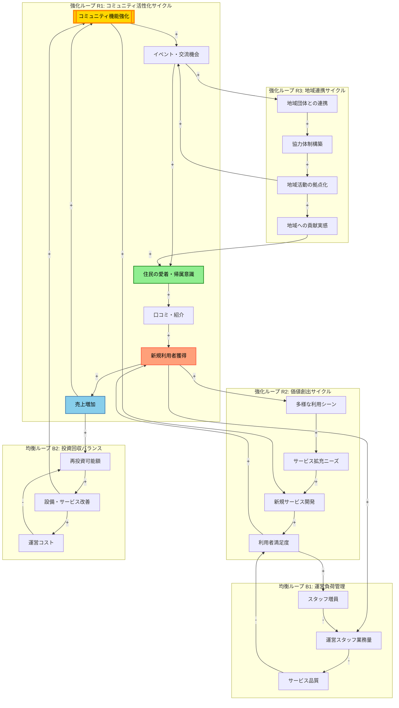

# 因果関係ループ図: 風呂屋復活プロジェクト

## 概要

町内会の若手20名が廃業危機の銭湯を「コミュニティ湯処」として再生する企画の因果関係構造を可視化しました。分析の結果、**3つの強化ループ**と**2つの均衡ループ**を特定しました。

最も重要なレバレッジポイントは**「コミュニティ機能の強化」**であり、これが複数の好循環を同時に起動させる起点となることが判明しました。施設の単なる修繕ではなく、コミュニティ価値の創出が成功の鍵です。

## メイン図: 風呂屋復活プロジェクトの因果関係構造

## 分析結果

### 強化ループ（好循環）

#### **R1: コミュニティ活性化サイクル**
- **メカニズム**: コミュニティ機能の強化 → イベント・交流機会の増加 → 住民の愛着・帰属意識の向上 → 口コミ・紹介の活性化 → 新規利用者獲得 → 売上増加 → さらなるコミュニティ機能への投資
- **特徴**: プロジェクトの中核となる最重要ループ。銭湯を単なる入浴施設から「地域の居場所」へ転換することで、持続的な成長を実現
- **成功要因**: 住民の感情的つながり（愛着・帰属意識）が自然な口コミを生み、マーケティングコストをかけずに新規顧客を獲得

#### **R2: 価値創出サイクル**
- **メカニズム**: 新規利用者獲得 → 多様な利用シーンの発見 → サービス拡充ニーズの顕在化 → 新規サービス開発 → 利用者満足度の向上 → さらなる新規利用者獲得
- **特徴**: 利用者の多様性が新しい価値創出の源泉となる。銭湯の固定観念を超えた柔軟なサービス開発が可能に
- **成功要因**: 若手出資者20名の多様な視点とアイデアを活かし、従来の銭湯にはなかった付加価値を創出

#### **R3: 地域連携サイクル**
- **メカニズム**: イベント・交流機会 → 地域団体との連携 → 協力体制構築 → 地域活動の拠点化 → 地域への貢献実感 → 住民の愛着向上 → さらなるイベント開催
- **特徴**: 銭湯が地域のハブとして機能し、様々な団体・活動を結びつける。R1ループと相互強化
- **成功要因**: 町内会という既存ネットワークを活用し、スムーズに地域連携を構築できる

### 均衡ループ（安定化メカニズム）

#### **B1: 運営負荷管理**
- **メカニズム**: 新規利用者増加 → 運営スタッフの業務量増加 → サービス品質の低下リスク → 利用者満足度低下 → スタッフ増員による対応 → 業務量の適正化
- **特徴**: 急成長による品質低下を防ぐ安全弁。適切な人員配置が重要
- **注意点**: スタッフ増員のタイミングが遅れると、R1・R2ループが停滞するリスク

#### **B2: 投資回収バランス**
- **メカニズム**: 売上増加 → 再投資可能額の増加 → 設備・サービス改善 → 運営コストの増加 → 再投資余力の減少
- **特徴**: 投資と収益のバランスを保つ自己調整機能。過剰投資を抑制
- **注意点**: コスト増加が売上増加を上回ると、悪循環に転じる可能性

## レバレッジポイント（最重要介入点）

### **1. コミュニティ機能の強化（最重要）**
- **理由**: R1、R3の起点であり、R2にも間接的に影響。複数の強化ループを同時に起動
- **推奨アクション**:
  - くつろぎスペースなど「滞在・交流できる場」の整備
  - 定期イベント（交流イベント企画・運営）の体制構築
  - 地域交流コーディネーターの配置
- **効果**: 初期投資で最大のリターンが期待できる。銭湯の差別化要因にもなる

### **2. 住民の愛着・帰属意識（感情的コア）**
- **理由**: R1とR3の交点。感情的つながりが口コミという無料マーケティングを生む
- **推奨アクション**:
  - 「自分たちの銭湯」という意識を醸成（コミュニティ湯処ブランド構築ワークショップ）
  - 住民参加型イベントの定期開催
  - 常連客同士の交流促進サポート
- **効果**: マーケティングコストを削減し、持続的な集客を実現

### **3. 新規利用者獲得（成長エンジン）**
- **理由**: R1とR2の結節点。新規顧客が新しいニーズと価値創出を促進
- **推奨アクション**:
  - 近隣地域向け体験イベントの開催
  - コミュニティ情報発信プラットフォームによる情報発信
  - 町内住民向け割引制度の活用
- **効果**: 多様な顧客層の獲得が、サービス拡充の原動力となる

## 施策の優先順位

### **フェーズ1: 基盤構築（最初の3ヶ月）**
1. **コミュニティスペースの整備**（レバレッジポイント1への直接介入）
   - くつろぎスペースの設置・運営開始
   - 地域交流コーディネーターの配置

2. **定期イベントの企画・開始**（R1ループの起動）
   - 交流イベント企画・運営の開始
   - 銭湯文化体験プログラムの提供

3. **地域団体への連携開始**（R3ループの準備）
   - コミュニティ拠点運営体制の構築
   - 地域貢献活動の企画・実施

### **フェーズ2: ループ加速（3-6ヶ月）**
4. **ブランド構築と口コミ促進**（R1ループの加速）
   - コミュニティ湯処ブランド構築ワークショップの開催
   - コミュニティ情報発信プラットフォームの稼働

5. **新規サービスの展開**（R2ループの起動）
   - 顧客ニーズヒアリング活動に基づく改善
   - 地域交流促進アプリの導入

6. **運営体制の安定化**（B1ループの安定化）
   - 後継者育成OJTプログラムの実施
   - 経営改善アクションの実行

### **フェーズ3: 持続的成長（6ヶ月以降）**
7. **地域活動拠点化の推進**（R3ループの加速）
   - 成功モデル構築プロジェクトの推進
   - 地域活性化成果報告会の実施

8. **事業承継・持続性の確保**（B2ループの管理）
   - 事業承継メンター制度の構築
   - 経営状況モニタリングダッシュボードの導入

## 注意点・リスク

### 1. 遅延効果（タイムラグ）
- **愛着・帰属意識の形成**: 3-6ヶ月かかる。即効性は期待できない
- **口コミ効果の顕在化**: 初期は限定的。6ヶ月以降に本格化
- **対策**: 短期的な集客施策（近隣地域向けキャンペーン等）と並行して、長期的なコミュニティ形成に投資

### 2. 意図しない副作用
- **「常連の場」化**: 新規利用者が入りづらい雰囲気になるリスク
  - 対策: 地域交流コーディネーターによる新規客への声かけ
- **イベント疲れ**: 運営スタッフや出資者の負担増
  - 対策: イベントのルーティン化、若手協力者定例ミーティングでの負担分散

### 3. 均衡ループの暴走リスク
- **B1（運営負荷）**: スタッフ増員が追いつかず、品質低下 → 顧客離反
  - 対策: 成果モニタリング会議での早期検知
- **B2（投資回収）**: 過剰投資によるキャッシュフロー悪化
  - 対策: 経営状況モニタリングダッシュボードによる監視

## 結論

風呂屋復活プロジェクトの成功は、**「銭湯」ではなく「コミュニティ湯処」として機能すること**に依存します。因果関係ループ図の分析から、以下が明確になりました：

1. **最重要施策**: コミュニティ機能の強化（地域交流コーディネーター配置、くつろぎスペース運営、交流イベント企画）
2. **成功の鍵**: 住民の感情的つながり（愛着・帰属意識）の醸成
3. **成長エンジン**: 口コミによる自然な新規顧客獲得と、多様な利用者からの新価値創出
4. **安定化要因**: 適切な人員配置（B1）と投資管理（B2）

施設の物理的改装は必要条件ですが、それだけでは不十分です。**コミュニティ価値の創出が、持続的な成長を実現する十分条件**となります。
