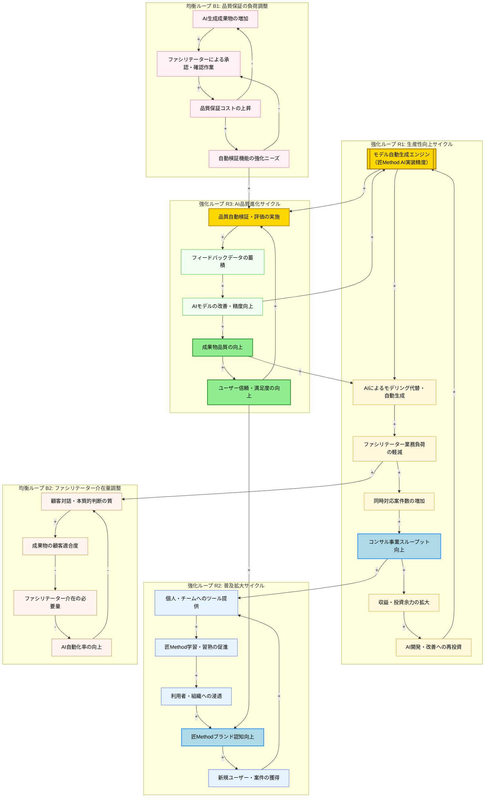

# 因果関係ループ図

## 概要

匠Method Agentは、ビジネスデザインメソッドをAIで自動化・支援するツールです。本図では、**コンサル事業の生産性向上**、**匠Methodの社会普及**、**AI技術力の蓄積**という3つの価値軸を中心に因果関係を分析しました。

主要な発見事項は以下の通りです。

- **強化ループが3つ**確認されました。「生産性向上サイクル」「普及拡大サイクル」「AI品質進化サイクル」のいずれも自己強化型であり、一度勢いがつくと加速度的に成長します。
- **均衡ループが2つ**確認されました。「品質保証の負荷調整」と「ファシリテーター介在量調整」は、自動化の過度な推進による品質劣化や信頼失墜を防ぐ抑止メカニズムです。
- **最大のレバレッジポイント**は「匠MethodナレッジのAI実装精度」です。ここが低ければ全てのループが機能しません。逆にここを高めることで、全てのループが連鎖的に強化されます。

---

## メイン図: 匠Method Agentの因果関係構造

---

## 分析結果

### 強化ループ

- **R1: 生産性向上サイクル**: モデル自動生成エンジンの精度が上がるほど、ファシリテーターの業務負荷が減り、同時対応案件が増え、収益増→AI再投資という好循環が生まれます。コンサル事業の競争力強化に直結する最重要ループです。
- **R2: 普及拡大サイクル**: 個人・チームへのツール提供が学習・浸透を促進し、ブランド認知向上→新規ユーザー獲得→さらなるツール普及という社会的影響力の拡大サイクルです。ストック型の成長を生みます。
- **R3: AI品質進化サイクル**: 品質自動検証からフィードバックデータを蓄積し、AIモデルを継続改善することで、成果物品質とユーザー信頼が向上するサイクルです。このループが機能するほどR1・R2の信頼基盤が強化されます。

### 均衡ループ

- **B1: 品質保証の負荷調整**: AI生成成果物の量が増えるほど承認・確認作業が増加し、品質保証コストが上昇します。これが抑制力となり、自動検証機能の強化ニーズを生みます。自動化が進めばファシリテーターの確認作業は減少し、均衡します。
- **B2: ファシリテーター介在量調整**: AI自動化率の向上は一方で、顧客との本質的対話の質を低下させるリスクを持ちます。成果物の顧客適合度が下がるとファシリテーターの介在が必要になり、自動化率の過剰な推進に歯止めがかかります。

### レバレッジポイント

1. **匠MethodナレッジのAI実装精度（モデル自動生成エンジン）**
   - R1・R2・R3の全ループに影響する最上位の起点です。ここの精度が低いと全ての好循環が機能しません。最初に「匠Method正確性保証エンジン（IT要求27）」と「ブランド品質基準維持・監査（活動23）」に集中投資することが最重要です。
   - 推奨アクション: 匠Method正確性検証レビュー（活動21）を定期的に実施し、ナレッジベースを継続的に更新する。

2. **品質自動検証・フィードバックデータの蓄積（R3の核心）**
   - ユーザーフィードバック収集・改善提案（活動29）と品質自動検証機能（IT要求2）は、AIの進化速度を左右します。早期にデータ蓄積を開始するほど、改善サイクルが速く回ります。
   - 推奨アクション: MVP段階から品質評価データを記録し、フィードバック収集の仕組みを組み込む。

3. **ファシリテーター役割の再定義（B2ループの安定化）**
   - AI自動化とファシリテーター介在のバランスを意図的に設計しないと、B2ループが悪化（顧客適合度の低下）または空洞化（ファシリテーターの不要化による知見喪失）します。活動3「ファシリテーター役割再定義」が均衡ループを健全に保つ鍵です。
   - 推奨アクション: 「AIが生成→ファシリテーターが判断・承認」という明確な役割分担を設計し、活動18（AI生成成果物ファシリテーター承認フロー整備）を早期に整備する。

4. **シングルユーザー完結型ワークフロー（R2ループの起爆剤）**
   - 個人が単独で匠Methodの全フェーズを完結させられること（業務要求6）は、普及拡大ループ（R2）の起点です。エントリーハードルを下げることで、利用者数が増え、フィードバックデータも増加し、R3ループとも連鎖します。
   - 推奨アクション: 個人ユーザー向け利用ガイド整備（活動6）とシングルユーザー完結型ワークフロー機能（IT要求20）を最初のリリースに含める。

### 施策の優先順位

| 優先度 | 施策 | 対応するループ | 根拠 |
|--------|------|---------------|------|
| 1 | 匠Methodナレッジ実装精度の確立（正確性検証レビュー・品質基準策定） | R1・R2・R3の全体基盤 | 全ループの起点であり、ここが脆弱だと全施策が無効化される |
| 2 | 品質自動検証機能とフィードバック収集の仕組み構築 | R3、B1の安定化 | 早期にデータ蓄積を開始するほど改善サイクルが加速する |
| 3 | シングルユーザー完結型ワークフローのMVPリリース | R2の起動 | 利用者数増加→フィードバック増加→R3ループとの連鎖を生む |
| 4 | ファシリテーター役割再定義と承認フロー整備 | B2の安定化 | AI自動化の暴走を防ぎ、顧客信頼を維持する |
| 5 | AI技術内製化トレーニングとナレッジ共有体制構築 | R1の持続化 | 外部依存を減らし、G→Aの再投資ループを自社内で完結させる |
| 6 | 匠Methodコンテンツ外部公開戦略と普及キャンペーン | R2の加速 | ブランド認知を広げ、L→Hのループを外部に広げる |
| 7 | ROI可視化と経営層向けレポーティング体制構築 | R1の信頼確保 | 経営層の継続投資（F→G）を促進し、R1ループを安定させる |

---

## 注意点・リスク

- **遅延効果**: 「AI実装精度向上」から「顧客・ファシリテーターの信頼獲得」までには最低3〜6ヶ月の実績積み上げが必要です。R1・R2ループが本格的に回り始めるまでは効果が見えにくい段階があります。
- **B2ループの悪化リスク**: AI自動化を急ぎすぎると、ファシリテーターの顧客対話スキルが形骸化し、成果物の顧客適合度が低下します。ツール依存と人的判断のバランスを意図的に設計することが必要です。
- **ブランド品質リスク**: R2ループで普及が先行し、品質基準の維持が追いつかない場合、匠Methodブランドの毀損（B1ループの逆転）が生じます。品質ガイドライン検証機能（IT要求19）と活動23（ブランド品質基準維持・監査）は普及施策と並行して進める必要があります。
- **LLM API依存リスク**: R1・R3ループの根幹はLLM APIの安定稼働に依存しています。活動27（LLM APIベンダー選定・契約管理）とIT要求16（LLM API統合・フォールバック管理）によるリスク分散が不可欠です。
